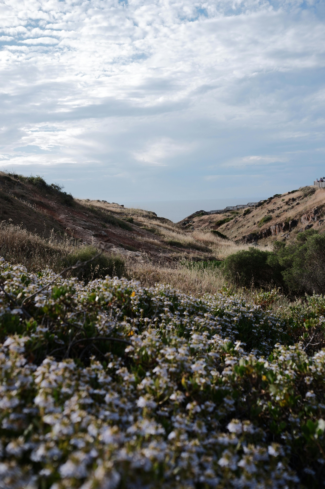
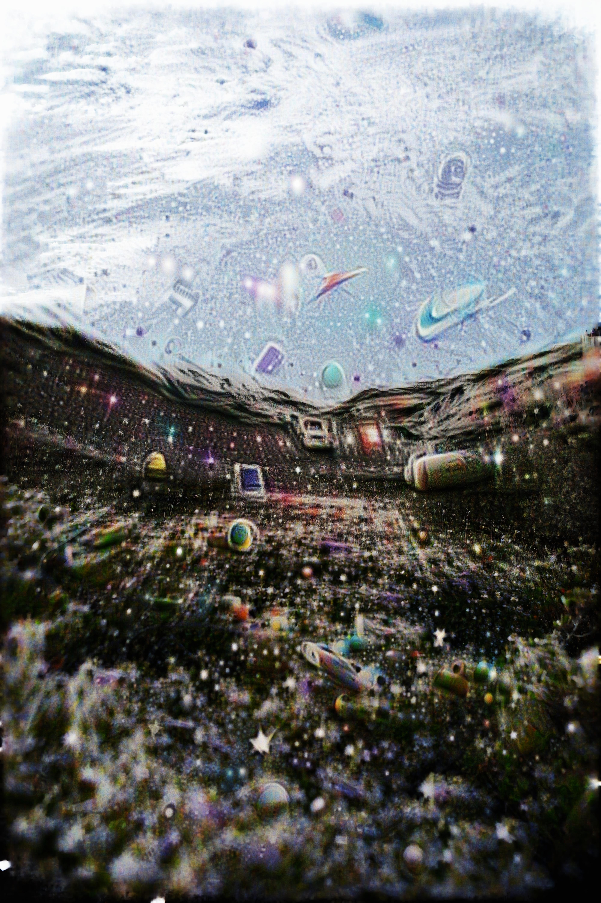

# CLIPDream

CLIP-guided image optimization. Feed it a prompt, watch it hallucinate shapes into your image.

Think Google's DeepDream but with text prompts instead of dog-eyes everywhere.

## Example

| Input | Output | Process |
|-------|--------|---------|
|  |  |  |

prompt: `"space"`

## What it does

- takes an input image
- you give it a text prompt like "skull" or "ocean waves"
- it optimizes the image pixels to match your prompt using CLIP
- outputs a trippy image and animated gif of the process

## How it works

1. coarse pass at 50% resolution (big shapes, heavy blur)
2. fine pass at 100% resolution (details, lighter blur)
3. color decorrelation to avoid rainbow noise
4. gradient blurring to keep it smooth
5. early stopping when improvement plateaus

## Usage

```bash
python clipdream.py "skull"
```

### Options

```
positional arguments:
  prompt                text prompt to optimize towards

options:
  -i, --input           input image path (default: assets/input.jpg)
  -o, --output          output image path (default: assets/output.jpg)
  -s, --steps           total optimization steps (default: 800)
  --lr                  learning rate (default: 0.08)
  --blur                gradient blur sigma (default: 3.0)
  --smooth              TV smoothness weight (default: 2.0)
  --cutouts             number of cutouts per step (default: 8)
  --no-gif              skip gif generation
  --gif-interval        capture frame every N steps (default: 4)
  --patience            early stop if no improvement for N steps (default: 20)
  --min-delta           minimum improvement to reset patience (default: 0.001)
```

### Examples

```bash
# basic (uses assets/input.jpg by default)
python clipdream.py "ocean waves"

# custom input/output
python clipdream.py "dragon" -i photo.jpg -o result.jpg

# more steps, no early stopping
python clipdream.py "face" --patience 9999

# skip gif for faster runs
python clipdream.py "skull" --no-gif
```

## Requirements

- pytorch
- torchvision
- open_clip
- pillow
- tqdm

```bash
pip install torch torchvision open-clip-torch pillow tqdm
```

## Outputs

- `assets/output.jpg` - final image
- `assets/output.gif` - animated process

## Citations

```bibtex
@article{radford2021clip, 
  title={Learning Transferable Visual Models From Natural Language Supervision}, 
  author={Radford, Alec and Kim, Jong Wook and Hallacy, Chris and Ramesh, Aditya and Goh, Gabriel and Agarwal, Sandhini and Sastry, Girish and Askell, Amanda and Mishkin, Pamela and Clark, Jack and others}, 
  journal={arXiv preprint arXiv:2103.00020}, 
  year={2021}
}

@software{ilharco2021openclip, 
  author={Ilharco, Gabriel and Wortsman, Mitchell and Carlini, Nicholas and Taori, Rohan and Dave, Achal and Shankar, Vaishaal and Namkoong, Hongseok and Miller, John and Hajishirzi, Hannaneh and Farhadi, Ali and Schmidt, Ludwig}, 
  title={OpenCLIP}, 
  year={2021}, 
  doi={10.5281/zenodo.5143773}
}

@misc{mordvintsev2015deepdream, 
  title={Inceptionism: Going Deeper into Neural Networks}, 
  author={Mordvintsev, Alexander and Olah, Christopher and Tyka, Mike}, 
  howpublished={Google Research Blog}, 
  year={2015},
  url={https://research.google/blog/inceptionism-going-deeper-into-neural-networks/}
}

@article{rudin1992tv, 
  title={Nonlinear total variation based noise removal algorithms}, 
  author={Rudin, Leonid I. and Osher, Stanley and Fatemi, Emad}, 
  journal={Physica D: Nonlinear Phenomena}, 
  volume={60}, 
  pages={259--268}, 
  year={1992}
}
```

## License

[](https://opensource.org/licenses/MIT)

Read the full text in the [LICENSE](LICENSE) file.
